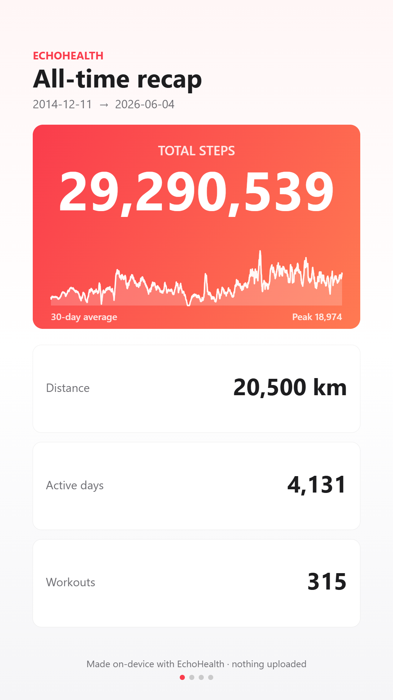
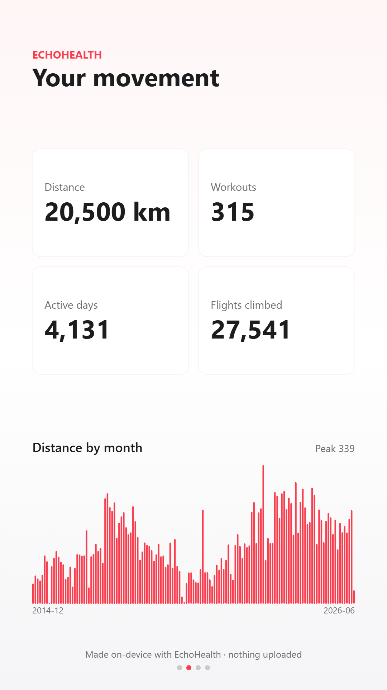
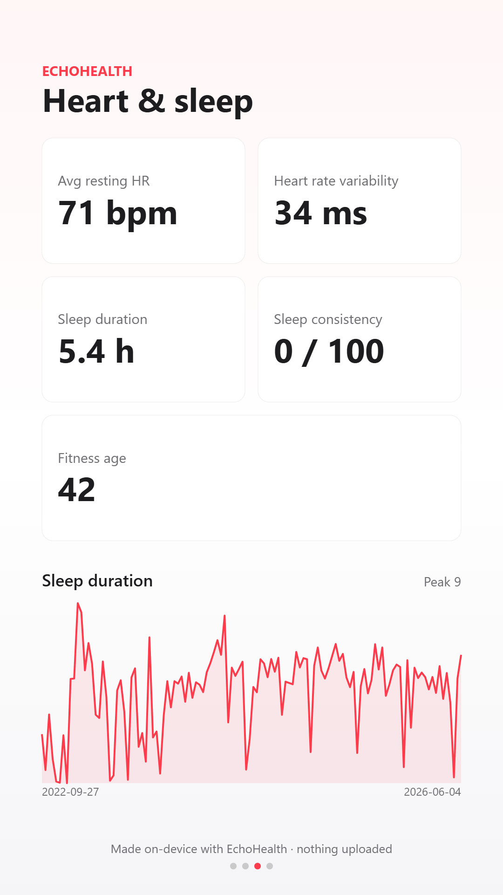
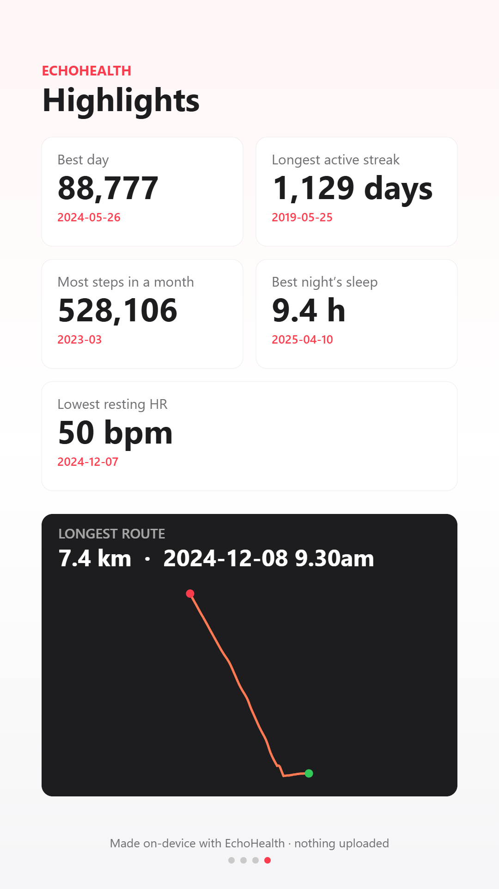

<div align="center">

# EchoHealth · 回声健康

**Turn your Apple Health export into a beautiful, interactive dashboard — 100 % client-side, zero data uploaded.**

将你的 Apple 健康导出数据变成交互式仪表盘 — 全部在浏览器本地完成，数据绝不上传。

[](https://github.com/CPLADRAGON/EchoHealth/actions/workflows/ci.yml)
[](LICENSE)


</div>

---

## Features

| | Feature | Description |
|---|---|---|
| 📊 | **14 interactive charts** | Steps, distance, energy, heart rate, HRV, VO₂ max, sleep, workouts & more |
| 🗓️ | **Activity & sleep heatmap** | GitHub-style calendar showing daily activity and sleep patterns |
| 🔍 | **Anomaly detection** | Automatically flags notable changes in your health metrics |
| 📈 | **Correlations** | Same-day & next-day (lagged) correlation analysis between metrics |
| 🗺️ | **GPS routes map** | Interactive Leaflet map of all workout routes, colored by pace |
| 🏆 | **Streaks & records** | Personal bests, longest streaks, year-in-review recap cards |
| 🤖 | **AI Health Assistant** | Ask questions about your data (optional Gemini integration) |
| 🌐 | **Bilingual** | English / 中文 toggle |
| 🌙 | **Dark mode** | Light & dark themes |
| 📱 | **PWA** | Install as an app on desktop or mobile |
| 🔒 | **100 % private** | All processing in-browser — nothing ever leaves your machine |

---

## EchoHealth Web — run it in your browser

`web/index.html` is a **single-page web app** that does everything client-side:
drop your Apple Health `export.zip` (or `export.xml`) and it parses and charts
your data **entirely inside the browser tab** with a streaming pure-JavaScript
parser. Nothing is uploaded, no account, no server. English / 中文 toggle, light /
dark themes, PWA install, and a first-visit privacy + tutorial guide are built in.
Works on desktop and mobile browsers.

### Quick start

```bash
git clone https://github.com/CPLADRAGON/EchoHealth.git
cd EchoHealth/web
python -m http.server 8777        # or any static server
# open http://localhost:8777 and drop your export.zip in
```

### One-click deploy

[](https://vercel.com/new/clone?repository-url=https%3A%2F%2Fgithub.com%2FCPLADRAGON%2FEchoHealth&root-directory=web)

Import this repo on Vercel with **Root Directory = `web`**, framework "Other", no
build command. It deploys as a static site. GitHub Pages also works.

### Recap cards

<p align="center">
  
  
  
  
</p>

### AI Health Assistant (optional)

After your data loads, an **AI Health Assistant** panel lets users ask questions
about their stats. It calls a tiny Vercel serverless function (`web/api/chat.js`)
that proxies to Google **Gemini 3.1 Flash Lite** — the API key lives **only** on
the server and never reaches the browser. Only **summary statistics** (not raw
records) are sent to the model.

To enable it on Vercel, add an environment variable:

- `GEMINI_API_KEY` — your Google AI Studio API key (required)
- `GEMINI_MODEL` — optional, defaults to `gemini-3.1-flash-lite`

The static dashboard works fully offline without this; only the chat panel needs
the function. (Gemini/Vercel may be unreachable in regions that block them, e.g.
mainland China, but the rest of the app still runs locally.)


> Privacy: this repo intentionally excludes all personal health data
> (`apple_health_export/`, `*.gpx`) via `.gitignore`. Only the code is published.

### Architecture & development (web app)

Static site under `web/`, no build step — deployed as-is.

- `web/index.html` — markup + head; loads the app scripts.
- `web/app.js` — the app logic (UI, CSS hooks, rendering, charts, map, recap, AI client,
  anomaly panel, lagged-correlation patterns, activity/sleep heatmap, SSE AI streaming).
- `web/parser.js` — the **pure parsing core**: streaming-tag aggregation, metric series,
  fitness-age + sleep-consistency math, GPS route helpers, plus the pure analytics
  (`detectAnomalies`, `correlate`/`pearson`/`shiftDay`). DOM-free and dependency-free,
  loaded as a classic `<script>` before the app script and **unit-tested in Node**.
  The browser-only streaming + unzip wrapper (`parseHealthExport`) stays in `app.js`
  and calls into this module.
- `web/sample.js` — builds a synthetic demo `export.zip` in-browser (`buildSampleFile()`)
  for the "Try with sample data" button.
- `web/api/chat.js` — Vercel serverless proxy to Gemini, SSE-streamed (API key server-side only).
- `web/service-worker.js` + `manifest.webmanifest` + icons — PWA shell.
- `web/vercel.json` — clean URLs + security headers (Content-Security-Policy, etc.).

Conventions: heavy libraries (Plotly, Leaflet, jsPDF) are **lazy-loaded** only when first
needed; all user-facing strings go through the `I18N` dictionary (`en` + `zh`); theming is
CSS-variable based with a `[data-theme="dark"]` override; file-derived strings are escaped
(`esc()`) before any `innerHTML`; no emoji in the UI.

**Tests** — the parsing core has a zero-dependency Node test suite:

```powershell
node --test    # or: npm test
```

CI runs it on every push/PR to `main` (`.github/workflows/ci.yml`). When you change
`web/parser.js`, add or update a test in `tests/parser.test.js`. `tests/sample.test.js`
additionally runs the demo generator end-to-end through the parser.

---

## Desktop pipeline (Python)

A separate, higher-powered pipeline renders a richer report locally.

## What you get

`output/dashboard.html` — a single, self-contained page with:

| Section | Charts |
|---|---|
| 🏃 **Activity** | Daily steps + 30-day average · steps calendar heatmap · monthly distance · monthly energy (active vs resting) |
| ❤️ **Heart & Cardio** | Resting heart rate trend · 12-month HR range (min/avg/max) · HRV (SDNN) · VO₂ max |
| 😴 **Sleep** | Nightly sleep duration + 14-night average · bedtime consistency |
| 🗺️ **Workouts & Routes** | Workouts per month · workout types · GPS route distance (coloured by pace) |

`output/routes_map.html` — a Leaflet map overlaying all GPS workout routes,
with popups (distance / duration) and start/end markers on your longest route.

## Setup

```powershell
python -m venv .venv
.\.venv\Scripts\python.exe -m pip install -r requirements.txt
```

Place your Apple export so that `apple_health_export/export.xml` and
`apple_health_export/workout-routes/*.gpx` exist (the default layout from the
iPhone Health app → *Export All Health Data*).

## Run

```powershell
.\.venv\Scripts\python.exe run.py
```

Then open `output/dashboard.html` in your browser.

You can also run individual stages:

```powershell
.\.venv\Scripts\python.exe src\parse_export.py      # export.xml  -> data/*.parquet
.\.venv\Scripts\python.exe src\parse_gpx.py         # *.gpx       -> data/routes.*
.\.venv\Scripts\python.exe src\build_routes_map.py  # -> output/routes_map.html
.\.venv\Scripts\python.exe src\build_dashboard.py   # -> output/dashboard.html
```

## How it works

- **`src/parse_export.py`** streams the (large) `export.xml` with `lxml.iterparse`
  so memory stays flat. High-frequency metrics (steps, distance, energy…) are
  summed to **daily** resolution; heart-rate metrics are reduced to daily
  min/avg/max; sleep segments and workouts are kept at full resolution. Results
  are written as Parquet in `data/`.
- **`src/parse_gpx.py`** reads each route, computes distance / duration / pace /
  elevation gain, and down-samples each track to ≤300 points for a light map.
- **`src/build_dashboard.py`** renders Plotly figures into one styled HTML file
  (Plotly JS is inlined, so it works offline).
- **`src/build_routes_map.py`** builds the Folium/Leaflet map.

## Notes

- Re-export from your phone and re-run `run.py` any time to refresh.
- `data/` and `output/` are regenerated artifacts; `apple_health_export/`,
  `.venv/`, `data/`, and `output/` are git-ignored by default.
- Everything is local and offline — no network calls, no telemetry.

## Contributing

Contributions are welcome! Feel free to open an issue or submit a pull request.

1. Fork the repo
2. Create your feature branch (`git checkout -b feature/amazing-feature`)
3. Run the tests (`npm test`)
4. Commit your changes
5. Push to the branch and open a Pull Request

## Star History

If you find EchoHealth useful, please consider giving it a ⭐ — it helps others discover the project!

## License

[MIT](LICENSE)
